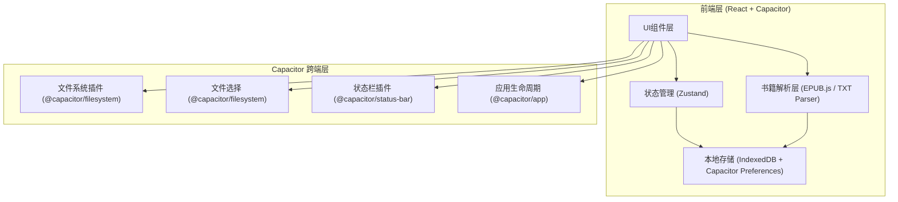
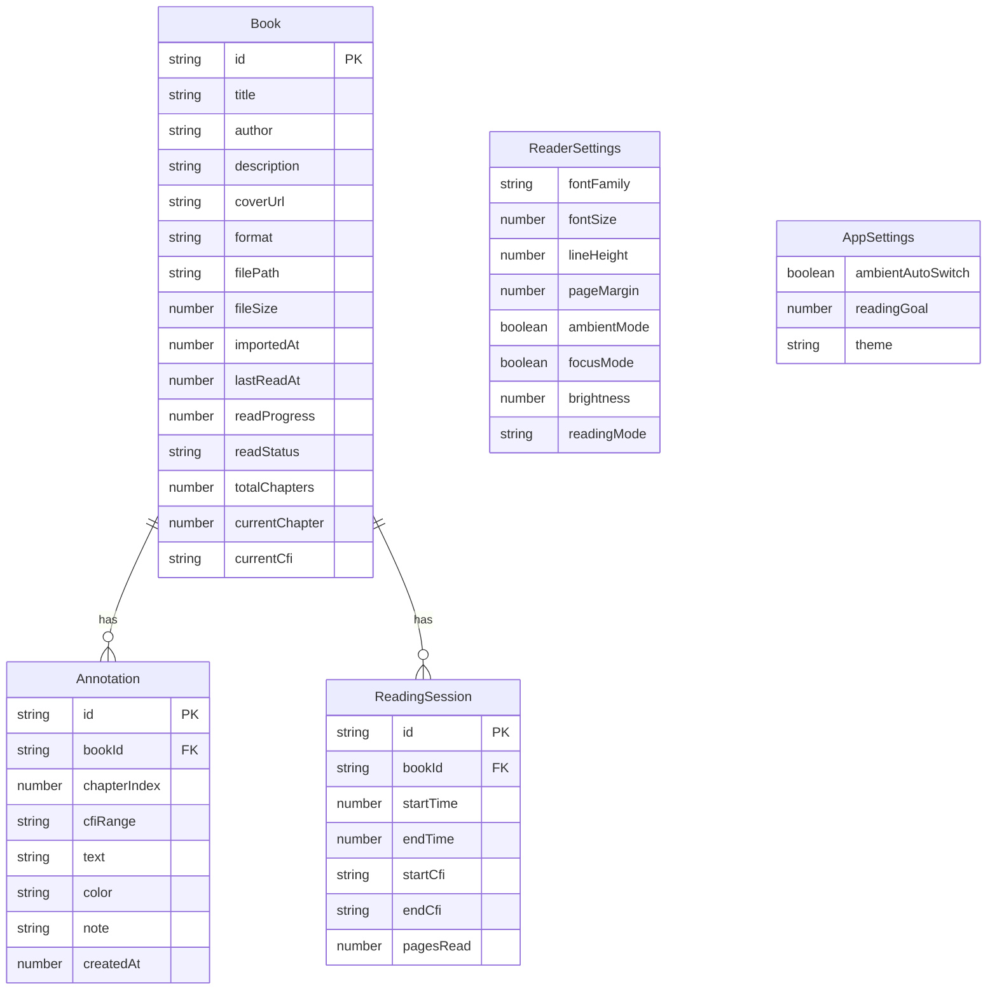

## 1. 架构设计



## 2. 技术说明

- **前端框架**: React 18 + TypeScript + Vite
- **初始化工具**: vite-init (react-ts 模板)
- **跨端方案**: Capacitor 6 (支持 Web / iOS / Android)
- **样式方案**: Tailwind CSS 3 + CSS Variables (氛围主题切换)
- **状态管理**: Zustand
- **路由**: React Router DOM 6
- **EPUB 解析**: epubjs (epubjs-v5)
- **图标库**: lucide-react
- **字体**: Google Fonts (Noto Serif SC, Noto Sans SC)
- **本地存储**: IndexedDB (via idb) 存储书籍内容和标注，Capacitor Preferences 存储设置项
- **后端**: 无 (纯本地应用)

## 3. 路由定义

| 路由 | 用途 |
|------|------|
| / | 书架页，展示已导入书籍和阅读统计 |
| /read/:bookId | 阅读页，沉浸式阅读核心界面 |
| /detail/:bookId | 书籍详情页，元数据和标注管理 |
| /settings | 设置页，阅读偏好和氛围配置 |

## 4. API 定义

无后端 API，所有数据通过本地存储交互。

### 4.1 核心数据接口

```typescript
interface Book {
  id: string
  title: string
  author: string
  description: string
  coverUrl: string
  format: 'epub' | 'txt'
  filePath: string
  fileSize: number
  importedAt: number
  lastReadAt: number
  readProgress: number
  readStatus: 'unread' | 'reading' | 'finished'
  totalChapters: number
  currentChapter: number
  currentCfi: string
}

interface Annotation {
  id: string
  bookId: string
  chapterIndex: number
  cfiRange: string
  text: string
  color: 'red' | 'blue' | 'green' | 'yellow'
  note: string
  createdAt: number
}

interface ReadingSession {
  id: string
  bookId: string
  startTime: number
  endTime: number
  startCfi: string
  endCfi: string
  pagesRead: number
}

interface ReaderSettings {
  fontFamily: 'serif' | 'sans' | 'kai'
  fontSize: number
  lineHeight: number
  pageMargin: number
  ambientMode: boolean
  focusMode: boolean
  brightness: number
  readingMode: 'paginate' | 'scroll'
}

interface AppSettings {
  ambientAutoSwitch: boolean
  readingGoal: number
  theme: 'auto' | 'light' | 'dark'
}
```

## 5. 服务器架构图

无服务器架构，纯客户端应用。

## 6. 数据模型

### 6.1 数据模型定义



### 6.2 存储方案

- **IndexedDB (via idb)**: 存储 Book、Annotation、ReadingSession 数据
  - `books` store: 以 id 为主键，按 importedAt 索引
  - `annotations` store: 以 id 为主键，按 bookId 索引
  - `readingSessions` store: 以 id 为主键，按 bookId + startTime 复合索引
- **Capacitor Preferences**: 存储 ReaderSettings、AppSettings 键值对
- **Capacitor Filesystem**: 存储导入的书籍文件副本

## 7. 项目目录结构

```
src/
  components/
    bookshelf/
      BookSpine.tsx          # 书脊组件
      ContinueReading.tsx    # 继续阅读卡片
      ImportButton.tsx       # 导入按钮
      StatsCard.tsx          # 统计卡片
      BookFilter.tsx         # 筛选组件
    reader/
      AmbientBackground.tsx  # 氛围背景
      FocusOverlay.tsx       # 专注模式遮罩
      InkProgress.tsx        # 墨迹进度条
      AnnotationPopup.tsx    # 标注弹窗
      ReaderToolbar.tsx      # 阅读工具栏
      PaginatedReader.tsx    # 翻页模式阅读器
      ScrollReader.tsx       # 滚动模式阅读器
      ReadingModeToggle.tsx  # 阅读模式切换按钮
    detail/
      BookCover.tsx          # 封面展示
      AnnotationList.tsx     # 标注列表
    settings/
      FontSelector.tsx       # 字体选择器
      AmbientConfig.tsx      # 氛围配置
      SliderControl.tsx      # 滑块控件
    common/
      AppBar.tsx             # 顶部导航栏
      IconButton.tsx         # 图标按钮
  pages/
    BookshelfPage.tsx        # 书架页
    ReaderPage.tsx           # 阅读页
    DetailPage.tsx           # 书籍详情页
    SettingsPage.tsx         # 设置页
  hooks/
    useAmbient.ts            # 氛围模式Hook
    useBookParser.ts         # 书籍解析Hook
    useReadingTracker.ts     # 阅读追踪Hook(自动保存进度)
    useAnnotations.ts        # 标注管理Hook
    useReaderSettings.ts     # 阅读设置Hook
    useProgressSync.ts       # 进度同步Hook(阅读位置持久化)
  stores/
    bookStore.ts             # 书籍状态
    readerStore.ts           # 阅读器状态
    settingsStore.ts         # 设置状态
  utils/
    epubParser.ts            # EPUB解析工具
    txtParser.ts             # TXT解析工具
    ambientThemes.ts         # 氛围主题定义
    db.ts                    # IndexedDB操作封装
    storage.ts               # Capacitor Preferences封装
  types/
    index.ts                 # 全局类型定义
  App.tsx
  main.tsx
  index.css
```
